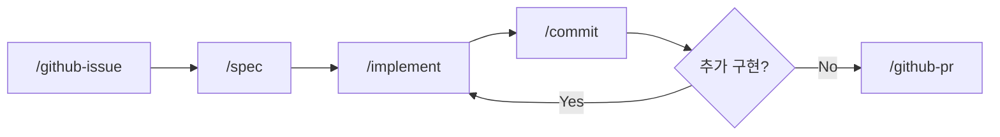

# AI-Native Development Guide

Claude Code 기반 개발 워크플로우

## 요구사항

- [Claude Code CLI](https://docs.anthropic.com/en/docs/claude-code) 설치
- GitHub CLI (`gh`) 설치
- [claude-devex](https://github.com/idean3885/claude-devex) 플러그인 설치

### 플러그인 설치

```bash
# 마켓플레이스 등록 (최초 1회)
claude plugins marketplace add https://github.com/idean3885/claude-devex.git

# 플러그인 설치
claude plugins install claude-devex@claude-devex
```

## GitHub 인증 설정

devex 스킬(`/github-issue`, `/github-pr` 등)은 `gh` CLI를 사용합니다.

```bash
# GitHub CLI 인증 (최초 1회)
gh auth login
```

편의 모드가 필요하면 `settings.local.json`에 `gh` 명령 허용을 추가합니다:

```json
{
  "permissions": {
    "allow": [
      "Bash(gh:issue:*)",
      "Bash(gh:pr:*)",
      "Bash(gh:label:*)",
      "Bash(gh:api:*)"
    ]
  }
}
```

## 개발 사이클

```
Issue → Spec → Implement → Commit → PR
```

| 단계 | 스킬 | 설명 |
|------|------|------|
| 이슈 | `/github-issue` | GitHub 이슈 생성, 라벨 매핑, 브랜치명 제안 |
| 명세 | `/spec` | 요구사항 분석, 아키텍처 설계, 다이어그램 |
| 구현 | `/implement` | 설계 문서 기반 코드 구현 |
| 커밋 | `/commit` | diff 리뷰, 커밋 메시지 제안, 커밋 |
| PR | `/github-pr` | PR 생성, 이슈 연결 |
| 전체 사이클 | `/cycle` | 이슈 → 플랜 → 구현 → 리뷰 → PR → 검증 → 완료 |

### 사이클 흐름



## 디렉토리 구조

```
.claude/
├── README.md               # 이 파일 (워크플로우 가이드)
├── settings.json            # 공통 설정 [Git 추적]
├── settings.local.json      # 로컬 설정 [Git 무시]
└── skills/
    └── post/SKILL.md        # /post (프로젝트 전용 스킬)

.devex/                      # devex 플러그인 로컬 설정 [Git 무시]
└── project-profile.md       # 프로젝트별 /spec, /implement 커스터마이징
```

> devex 워크플로우 스킬은 플러그인으로 제공됩니다. 프로젝트별 커스터마이징이 필요하면 `.devex/project-profile.md`를 작성합니다.
